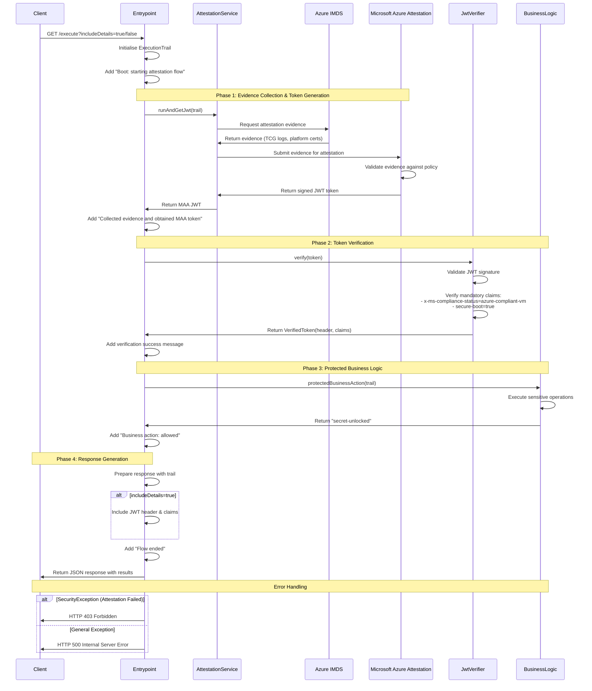
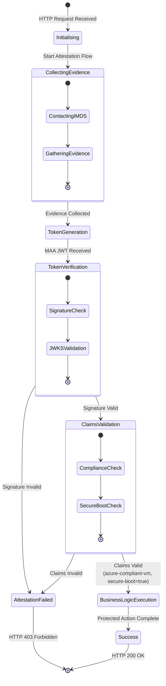

# Azure Confidential VM Attestation Demo Application (Java)

This Spring Boot application demonstrates how to perform attestation of an Azure Confidential Compute VM to ensure that business logic only executes when running on a trusted, compliant confidential computing environment.

## Overview

This application implements a secure attestation flow that verifies the integrity and compliance status of the host VM before executing protected business logic. It leverages Azure's Microsoft Azure Attestation (MAA) service to validate that the application is running on a genuine Confidential Compute VM with secure boot enabled.

## Key Features

- **VM Attestation**: Validates that the application is running on an Azure Confidential Compute VM
- **JWT Token Verification**: Verifies Microsoft Azure Attestation (MAA) JWT tokens
- **Compliance Checking**: Ensures secure boot is enabled and VM is Azure-compliant
- **Protected Business Logic**: Only executes sensitive operations after successful attestation
- **Detailed Execution Trail**: Provides comprehensive logging of the attestation process

## Reference Documentation

This application is based on the official Microsoft documentation and samples:

- **Primary Reference**: [Guest Attestation for Confidential VMs](https://learn.microsoft.com/en-us/azure/confidential-computing/guest-attestation-confidential-vms)
- **Sample Implementation**: [CVM Guest Attestation Sample App](https://github.com/Azure/confidential-computing-cvm-guest-attestation/tree/main/cvm-attestation-sample-app)

## Prerequisites

### VM Setup Requirements

Before running this application, you must set up the attestation environment on your Confidential VM. Follow the Linux build instructions from the [CVM attestation sample app repository](https://github.com/Azure/confidential-computing-cvm-guest-attestation/tree/main/cvm-attestation-sample-app), specifically:

1. Install the required attestation packages
2. Configure the IMDS attestation endpoint
3. Set up the necessary certificates and keys
4. Ensure the attestation client binaries are properly installed

### (Optional) Azure Attestation Provider

You may configure an Azure Attestation Provider resource for enhanced control over attestation policies and endpoint selection. By default, the application uses:

- `https://sharedeus2.eus2.attest.azure.net/` as the ATTESTATION_TENANT_URL

To override this, set the `attestUri` property to your custom Attestation Provider endpoint. See [Azure Attestation documentation](https://learn.microsoft.com/en-us/azure/attestation/overview) for details on creating and managing Attestation Providers.

### VM Specifications for Testing

#### Confidential VM (CVM) - Attestation Should Pass
- **VM Size**: Standard DC2ads v5 (2 vcpus, 8 GiB memory)
- **Region**: Azure Southeast Asia
- **Features**: AMD SEV-SNP enabled, secure boot, TPM 2.0

#### Non-Confidential VM - Attestation Should Fail
- **VM Size**: Standard DC1s v2 (1 vcpu, 4 GiB memory)  
- **Region**: Azure Australia East
- **Features**: Standard VM without confidential computing features

## Architecture Overview

```mermaid
graph TB
    Client[HTTP Client] --> Endpoint["/execute endpoint"]
    Endpoint --> Trail[ExecutionTrail]
    Endpoint --> AttSvc[AttestationService]
    Endpoint --> JwtVer[JwtVerifier]
    
    AttSvc --> IMDS[Azure IMDS<br/>Attestation Endpoint]
    IMDS --> MAA[Microsoft Azure<br/>Attestation Service]
    MAA --> JWT[MAA JWT Token]
    
    JWT --> JwtVer
    JwtVer --> Validation[Token Signature &<br/>Claims Validation]
    Validation --> Business[Protected Business Logic]
    
    Business --> Result[Business Result:<br/>"secret-unlocked"]
    
    subgraph "Attestation Flow"
        AttSvc
        IMDS
        MAA
        JWT
    end
    
    subgraph "Verification Flow"
        JwtVer
        Validation
    end
    
    subgraph "Protected Operations"
        Business
        Result
    end
```

## Attestation Flow Details

The `Entrypoint::execute` method implements a comprehensive attestation flow:



## Security Flow States



## API Reference

### GET /execute

Executes the complete attestation flow and returns the results.

#### Parameters
- `includeDetails` (optional, default: false): Include JWT header and claims in response

#### Response Format

**Success Response (HTTP 200)**:
```json
{
  "trail": [
    "Boot: starting attestation flow",
    "Collected evidence and obtained MAA token",
    "Verified token signature (alg = RS256, kid = <key-id>)",
    "Verified claims: x-ms-compliance-status=azure-compliant-vm, secure-boot=true",
    "Business action: allowed (attestation passed)",
    "Flow ended"
  ],
  "tokenHeader": { /* JWT header (if includeDetails=true) */ },
  "tokenClaims": { /* JWT claims (if includeDetails=true) */ },
  "businessResult": "secret-unlocked"
}
```

**Attestation Failure Response (HTTP 403)**:
```json
{
  "trail": [
    "Boot: starting attestation flow",
    "DENY business logic: Attestation failed - VM not compliant"
  ],
  "error": "Attestation failed - VM not compliant"
}
```

## Running the Application

### Prerequisites
- Java 21+
- Maven 3.6+
- Azure Confidential VM with attestation setup completed

### Build and Run
```bash
mvn clean package
java -jar target/hello-attestation-0.0.1-SNAPSHOT.jar
```

## Example: Running and Testing on Azure VMs

Before running the application, ensure both the JAR file (`hello-attestation-0.0.1-SNAPSHOT.jar`) and the `AttestationClient` binary are present on your VM. Instructions for building the `AttestationClient` are provided in the [CVM attestation sample app repository](https://github.com/Azure/confidential-computing-cvm-guest-attestation/tree/main/cvm-attestation-sample-app).

### 1. Run the Java Application

```bash
sudo java -jar ./hello-attestation-0.0.1-SNAPSHOT.jar --attestation.tenant.url=https://<your-attestation-provider>.attest.azure.net
```

### 2. Test on a Confidential VM (CVM)

#### Basic Attestation Request
```bash
curl http://localhost:8080/execute | jq
```
**Example Output:**
```json
{
  "trail": [
    "Boot: starting attestation flow",
    "Invoking AttestationClient: /usr/local/bin/AttestationClient -a https://<your-attestation-provider>.attest.azure.net -o token",
    "Invoking: /usr/local/bin/AttestationClient -o token > /var/tmp/maa_token.jwt",
    "AttestationClient exited with code 0",
    "AttestationClient output (truncated): eyJhbGciOiJSUzI1NiIsImprdSI6Imh0dHBzOi8v...",
    "Wrote token file /var/tmp/maa_token.jwt (len = 6172)",
    "Obtained JWT from AttestationClient (len=6172)",
    "Collected evidence and obtained MAA token",
    "Verified token signature (alg = RS256, kid = <redacted-key-id>)",
    "Verified claims: x-ms-compliance-status=azure-compliant-vm, secure-boot=true",
    "Business action: allowed (attestation passed)"
  ],
  "businessResult": "secret-unlocked"
}
```

#### Attestation Request with Token Details
```bash
curl http://localhost:8080/execute?includeDetails=true | jq
```
**Example Output:**
```json
{
  "trail": [
    "Boot: starting attestation flow",
    "Invoking AttestationClient: /usr/local/bin/AttestationClient -a https://<your-attestation-provider>.attest.azure.net -o token",
    "Invoking: /usr/local/bin/AttestationClient -o token > /var/tmp/maa_token.jwt",
    "AttestationClient exited with code 0",
    "AttestationClient output (truncated): eyJhbGciOiJSUzI1NiIsImprdSI6Imh0dHBzOi8v...",
    "Wrote token file /var/tmp/maa_token.jwt (len = 6172)",
    "Obtained JWT from AttestationClient (len=6172)",
    "Collected evidence and obtained MAA token",
    "Verified token signature (alg = RS256, kid = <redacted-key-id>)",
    "Verified claims: x-ms-compliance-status=azure-compliant-vm, secure-boot=true",
    "Business action: allowed (attestation passed)"
  ],
  "tokenHeader": {
    "jku": "https://<your-attestation-provider>.attest.azure.net/certs",
    "kid": "<redacted-key-id>",
    "typ": "JWT",
    "alg": "RS256"
  },
  "tokenClaims": {
    // Claims fields as returned, with any sensitive identifiers redacted or stubbed
    "x-ms-azurevm-osdistro": "Ubuntu",
    "x-ms-compliance-status": "azure-compliant-cvm",
    "secureboot": true,
    // ...other claims...
    "x-ms-azurevm-vmid": "<redacted-vmid>",
    "vmUniqueId": "<redacted-vmUniqueId>"
  },
  "businessResult": "secret-unlocked"
}
```

### 3. Test on a Non-Confidential VM

#### Basic Attestation Request
```bash
curl http://localhost:8080/execute | jq
```
**Example Output:**
```json
{
  "trail": [
    "Boot: starting attestation flow",
    "Invoking AttestationClient: /usr/local/bin/AttestationClient -a https://<your-attestation-provider>.attest.azure.net -o token",
    "Invoking: /usr/local/bin/AttestationClient -o token > /var/tmp/maa_token.jwt",
    "stderr: WARNING:esys:src/tss2-esys/api/Esys_NV_ReadPublic.c:309:Esys_NV_ReadPublic_Finish() Received TPM Error ",
    "stderr: ERROR:esys:src/tss2-esys/esys_tr.c:243:Esys_TR_FromTPMPublic_Finish() Error NV_ReadPublic ErrorCode (0x0000018b) ",
    "stderr: ERROR:esys:src/tss2-esys/esys_tr.c:398:Esys_TR_FromTPMPublic() Error TR FromTPMPublic ErrorCode (0x0000018b) ",
    "AttestationClient exited with code 0",
    "AttestationClient output (truncated): eyJhbGciOiJSUzI1NiIsImprdSI6Imh0dHBzOi8v...",
    "Wrote token file /var/tmp/maa_token.jwt (len = 2692)",
    "Obtained JWT from AttestationClient (len=2692)",
    "Collected evidence and obtained MAA token",
    "DENY business logic: Token verification error: Compliance check failed: null"
  ],
  "error": "Token verification error: Compliance check failed: null"
}
```

> **Note:** The above outputs have been redacted to remove sensitive information such as key IDs, VM IDs, and unique identifiers. Replace `<your-attestation-provider>` with your actual Azure Attestation Provider endpoint. Any long JWT tokens or identifiers are truncated or replaced with placeholders for security.

## Expected Behavior

### On Confidential VM (CVM)
- ✅ Attestation evidence collection succeeds
- ✅ MAA JWT token generation succeeds
- ✅ Token signature verification passes
- ✅ Compliance claims validation passes
- ✅ Protected business logic executes
- ✅ Returns HTTP 200 with "secret-unlocked"

### On Non-Confidential VM
- ❌ Attestation evidence collection may fail
- ❌ Claims validation fails (VM not azure-compliant-vm)
- ❌ Protected business logic is blocked
- ❌ Returns HTTP 403 Forbidden

## Key Components

- **`Entrypoint`**: Main REST controller implementing the attestation flow
- **`AttestationService`**: Collects evidence and obtains MAA JWT tokens
- **`JwtVerifier`**: Validates JWT signatures and mandatory claims
- **`ExecutionTrail`**: Tracks the execution flow for debugging and auditing
- **`VerifiedToken`**: Contains validated JWT header and claims

## Security Considerations

1. **Token Validation**: All JWT tokens are cryptographically verified against MAA public keys
2. **Mandatory Claims**: Strict validation of compliance status and secure boot requirements
3. **Error Handling**: Secure failure modes that don't leak sensitive information
4. **Audit Trail**: Comprehensive logging of all attestation attempts
5. **Business Logic Protection**: Sensitive operations only execute after successful attestation

## Troubleshooting

### Common Issues
1. **IMDS Endpoint Unavailable**: Ensure VM has proper network configuration
2. **Attestation Client Missing**: Verify prerequisite installation steps completed
3. **Certificate Issues**: Check TPM and platform certificate availability
4. **Claims Validation Failure**: Verify VM is properly configured as Confidential VM

### Debug Mode
Use `includeDetails=true` parameter to get full JWT token information for debugging.

## Purpose and Getting Started

This demo is designed to help Java developers understand and implement the attestation pattern described in the [Azure Confidential Computing documentation](https://learn.microsoft.com/en-us/azure/confidential-computing/guest-attestation-confidential-vms). It is not intended to demonstrate a unique approach, but rather to provide a clear, practical example of how to:

- Integrate attestation into a Java application
- Protect business logic using VM attestation
- Follow best practices for secure execution in confidential environments

By following this example, you can quickly get started with attestation in your own Java projects, adapting the provided code and flow to your specific requirements.
